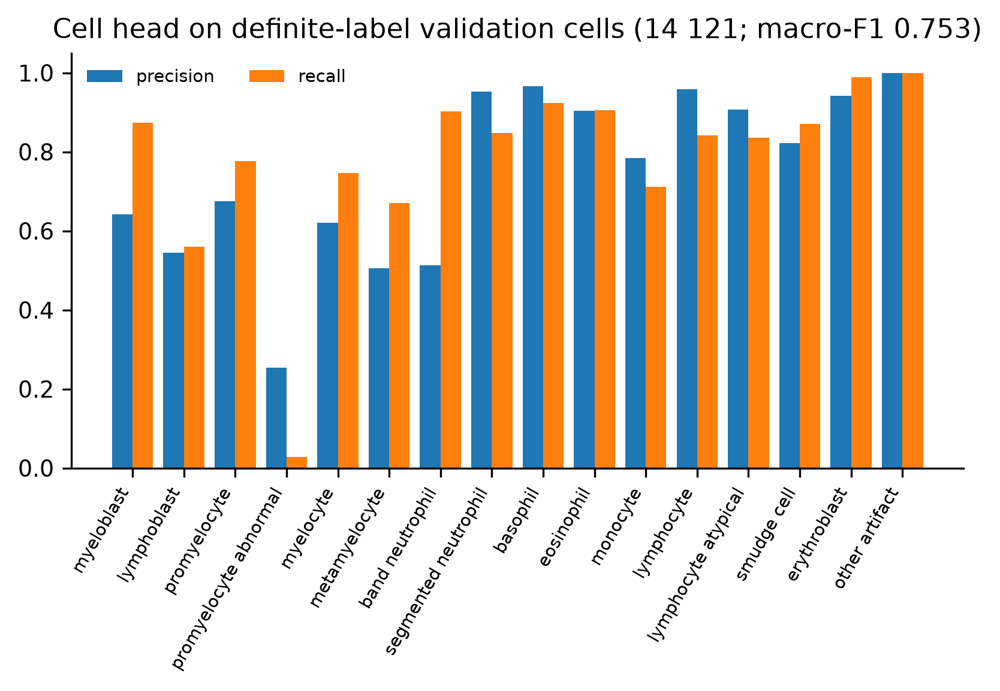
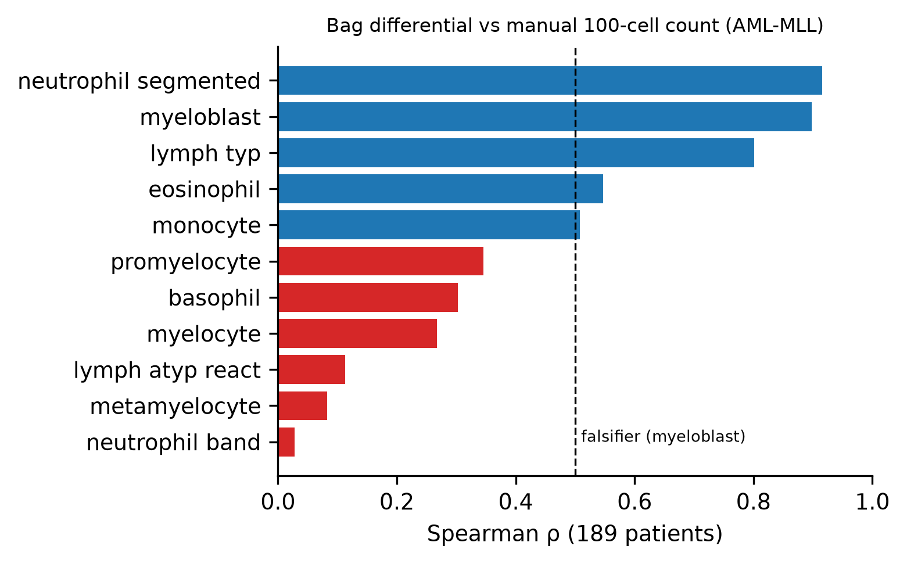
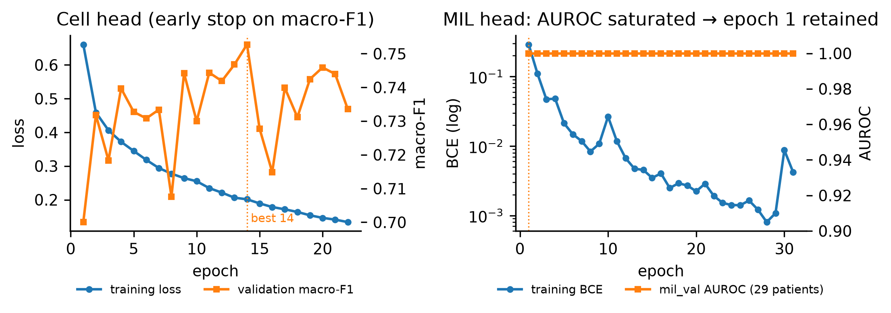
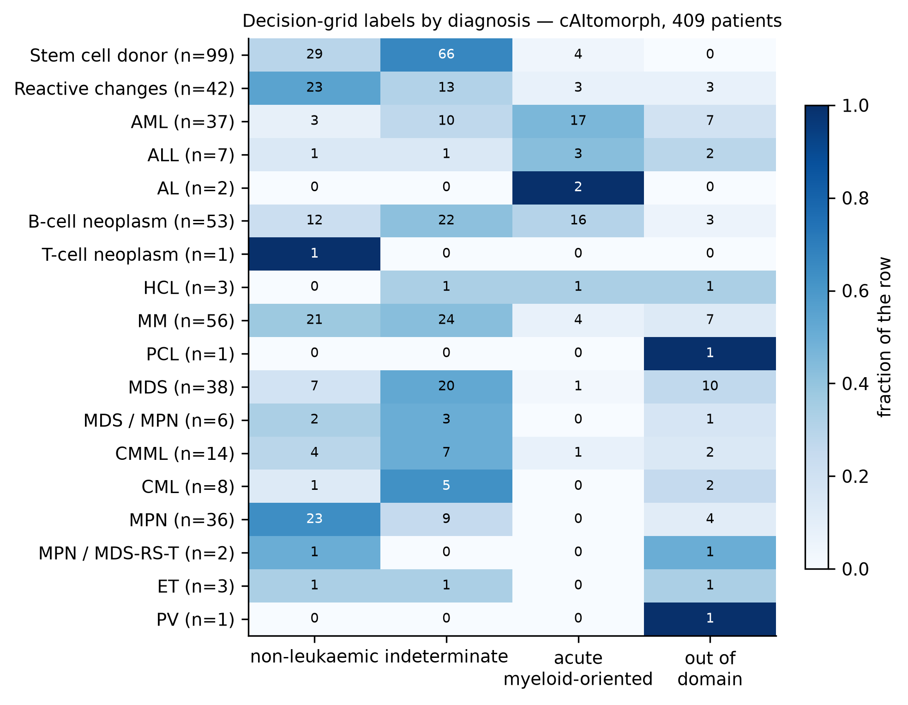
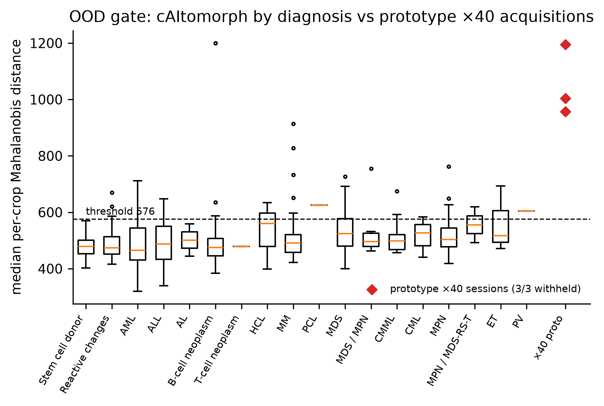
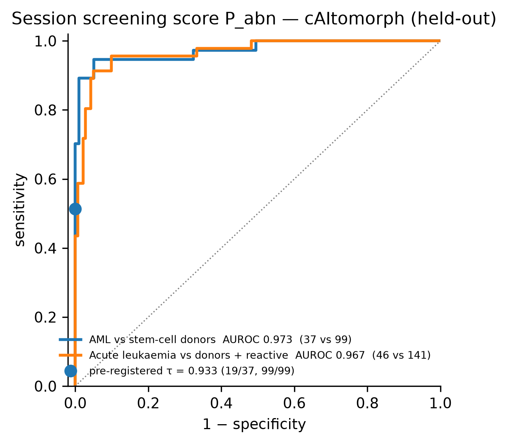
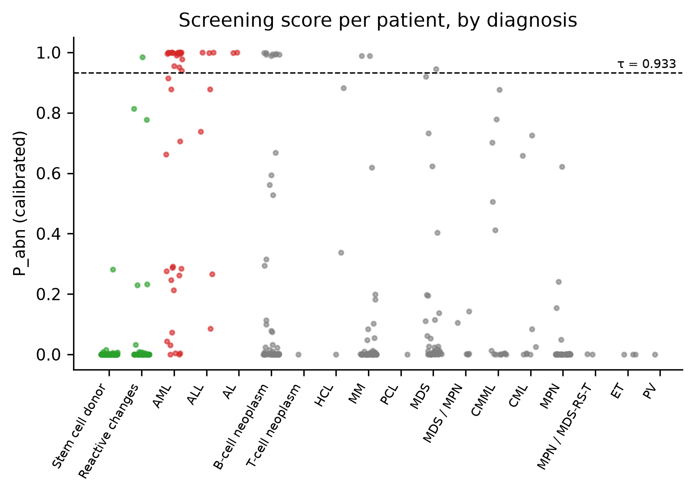
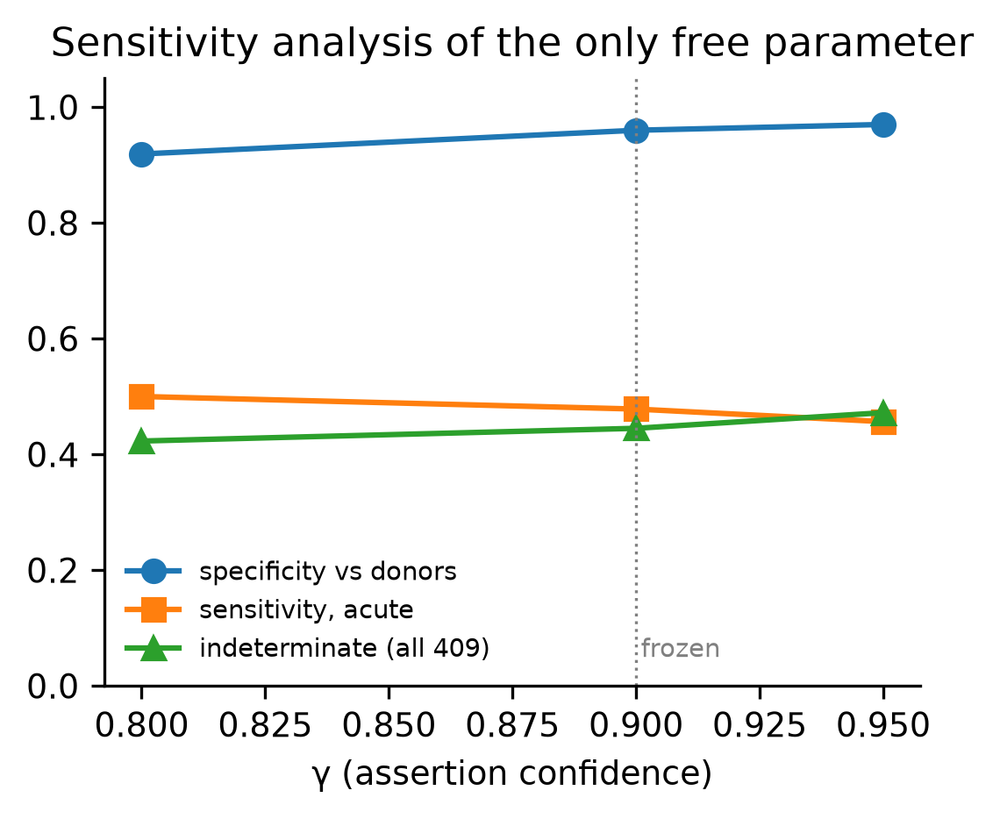
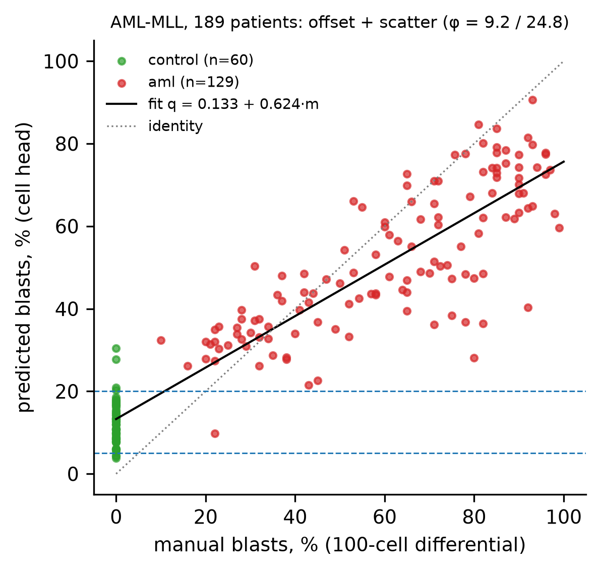

# ASTER block 2 — technical report for the article

**Scope.** Design, training, pre-registered held-out evaluation and edge packaging of
block 2 (session-level decision from the leukocyte crops produced by block 1) of the ASTER
edge-AI microscopy prototype. Every number in this report is read from the run directory
`runs/20260911_051357Z` (Google Colab, Tesla T4, 2026-09-11 05:13–16:21 UTC) or from the
repository `aster-block2/`; the file is named next to each result.

> **Release note (repository v1.0.0).** In this repository the run directory is
> `block2_development/training_run_20260911_051357Z/` (its `results/`, `metrics/`,
> `figures/`, `history/`, `env/`), and `aster-block2/` is `block2_development/`. The
> evaluation on cAItomorph is described as *held-out* (not external): see `docs/DATA.md` § 3.
> The on-device verification announced in § 11 was completed on 2026-09-12 (summary in
> § 11, full numbers in `docs/EVALUATION.md`). Correction to § 6.1 (row HCL / ET / …):
> non-leukaemic 3, out-of-domain 5, as in `results/caitomorph_409_confusion_full.csv`.

**Status.** Training, fitting and the primary held-out test are complete. On-device
(Jetson Orin Nano) verification, latency and energy were completed on 2026-09-12 (§11).

---

## 0. Results at a glance

| Claim | Result | Source |
|---|---|---|
| Session screening score (MIL head, P_abn), AML vs stem-cell donors, held-out | **AUROC 0.973** [0.937, 0.998] (37 vs 99) | `results/p_abn_screening.json` |
| Acute leukaemia vs donors + reactive changes | **AUROC 0.967** [0.935, 0.991] (46 vs 141) | same |
| Pre-registered operating point (τ fixed on development data) | specificity **99/99** [0.963, 1.000], sensitivity 19/37 = 0.514 [0.359, 0.666] | same |
| Decision grid, specificity vs donors / vs reactive | 95/99 = 0.960 / 39/42 = 0.929 | `results/caitomorph_409_confusion_full.csv` |
| Decision grid, sensitivity for acute leukaemia | 22/46 = 0.478 [0.341, 0.619]; abstention 44.5 % | same, `results/amendment9_metrics.json` |
| Prototype ×40 material (non-leukaemic) | **3/3 sessions withheld** as out-of-domain | `results/x40_stress.csv` |
| Cell differential vs manual count (189 AML-MLL patients) | Spearman ρ myeloblast 0.898, segmented 0.916, lymphocyte 0.801 | `results/differential_spearman.json` |
| Sensitivity of the grid to its only free parameter γ | smooth: sens 23→21/46, spec 0.919→0.970 for γ 0.80→0.95 | `results/sensitivity_ops.csv` |
| Chronic-pattern rules (CML-like, CLL-like) | **never fired** (0/409): inert, not validated | notebook §9 |
| Lineage (myeloid vs lymphoid) on acute calls | all 22 acute calls myeloid; ALL 0/3 | notebook §9 |

One-sentence summary for the abstract: *a crop-first, abstention-aware block 2 discriminates AML from donors with a held-out
session-level AUROC of 0.973, refuses to decide on the prototype's own ×40 acquisitions,
and exposes — with a pre-registered, falsifiable
design — that the morphological pattern rules are limited by patient-to-patient
instability of the cell classifier rather than by their thresholds.*

---

## 1. Design goals of block 2

**Block 1** (unchanged, deployed): YOLO11n single-class WBC localiser fine-tuned to the ×40
dry-objective domain (imgsz 960, conf 0.18, IoU 0.50), crops expanded 10 % per side and
clipped (`expand_and_clip_box` + `extract_crop`), then `SquarePad` (median of the four
corners, integer truncation) → 224 × 224 → ImageNet normalisation. Held-out ×40 test: P 0.92
/ R 0.96 / mAP50 0.96. This **crop contract** is verified
byte-for-byte (`tests/test_preprocess_parity.py`, `jetson/verify_on_jetson.py`).

Block 2 has to meet three requirements on the add-on:

1. **Abstain.** A decision is only safe if the system can refuse to give one — when the
   evidence is insufficient, ambiguous, or outside the validated acquisition domain.
2. **Count like a haematologist.** Session sizes follow the counting standards of manual
   cytology (100 / 200 / 400 leukocytes); with 50 cells, asserting "blasts ≥ 20 %" would
   need 28 % observed blasts.
3. **Speak the clinical question** (acute / chronic patterns, non-leukaemic) in
   morphological terms that a haematologist can check.

**Design goal (from the author):** do what a haematologist does — look at the cells first,
count them, then decide — and say "I don't know" when the evidence is insufficient.

## 2. Architecture of block 2

```
crops (block 1, unchanged contract)
  └─ encoder ResNet18, ONE pass per crop  →  [N, 512] features  (cached, reused by all heads)
       ├─ cell head: 16 classes (15 morphological + other_artifact)   → counts
       │     └─ quantifier (Adjusted Classify-and-Count per grid quantity) → corrected
       │        proportions + their uncertainty → effective (k, n)
       ├─ gated-attention MIL head on a seeded random bag of 200  → P_abn (temperature-scaled)
       ├─ blast lineage posterior (Σ p_lymphoblast / Σ p_blast over predicted blasts)
       └─ OOD gate: median per-crop Mahalanobis distance → in-domain / out-of-domain
  └─ FROZEN decision grid (rules R0–R5), each criterion a three-way Jeffreys test at γ = 0.90
       → label + tier + reasons (+ legacy final_label for the existing UI/back-end)
```

**Key choices and why**

| Choice | Reason |
|---|---|
| Encode once, all heads on the cached features | 750 → N encoder passes; pays for the extra heads inside the latency budget |
| Learned **cell** classifier + **declared** rules | Two of the five target classes (CML, CLL) have zero training patients anywhere except the test set; a rule validated on 8 CML patients is legitimate, a classifier tuned on them is not |
| Rules on **proportions**, each tested with a three-way Jeffreys posterior test (ASSERT / REJECT / INDETERMINATE, γ = 0.90) | a point estimate cannot support "≥ 20 %" on 50–500 cells; the test turns the count into a statement with a stated confidence and produces abstention naturally |
| Session sizes **100 / 200 / 400** classified leukocytes (tiers S / P / R) | documented manual-cytology standards [STD]: routine differential; EHA/ELN diagnostic differential on which the WHO 20 % blast criterion is applied; CLSI H20-A2 reference count. The author chose "do what cytologists do, if documented" over a tuned operating point |
| **Provenance tag** on every number: WHO / STD / CONV / REF / FIT / OPS | a reviewer can see which values are criteria, which are fitted and on what, and which are discretionary (only γ, the reference percentile and one R1a comparison are OPS, all sensitivity-analysed) |
| REF = max(clinical floor, 99th percentile of control patients) | reference-interval logic of clinical laboratories; the floor stops a small control group from producing an absurdly low threshold |
| Prevalence **corrected, not counted** (ACC) | counting a 95 %-specific classifier's argmax reports ~5 % smudge cells on a normal smear; raw counting made R3 assert smudge ≥ 2 % on a smear with zero smudge cells |
| MIL head only for screening (P_abn used in R1/R4 scope only) | trained on AML vs control only; it may not speak about chronic patterns |
| OOD gate before any decision | the ×40 failure of the deployed block |
| Morphological **pattern statements**, never diagnoses | lineage and entity need immunophenotyping/molecular tests |

**Vocabulary** (PREREGISTRATION.md §1.2): `non_leukemic`, `suspicious_for_neoplasm` (tier S),
`acute_blastic__{myeloid_oriented, lymphoid_oriented, lineage_indeterminate}`,
`chronic_myeloid_pattern`, `chronic_lymphoid_pattern` (tier P), `indeterminate`,
`insufficient_evidence`, `out_of_domain`; flags `APL_suspicion`, `monocytic_predominance`,
`reactive_lymphoid_observation`, `nucleated_rbc_present`. The mapping to the requested
ALL/AML/CLL/CML/non-leukaemic vocabulary is acuity (acute blastic vs chronic pattern) ×
lineage (myeloid vs lymphoid) — the closest statement that is scientifically supportable
from peripheral-blood morphology.

**The grid** (`src/aster_block2/decision_grid.yaml`, executor `grid.py`), first match wins:

| Rule | Criteria (all must ASSERT) | Label |
|---|---|---|
| R0 gates | OOD score ≤ threshold [FIT]; N_c ≥ 100 [STD]; N_c/N ≥ floor [FIT]; tier from N_c | out_of_domain / insufficient_evidence / indeterminate |
| R1 acute | blast_frac ≥ 20 % [WHO]; R1a APL: abn. promyelocytes ≥ θ_APL [FIT] and > myeloblasts [OPS]; R1b lineage band [FIT] | acute_blastic__* (+ APL_suspicion) |
| R2 chronic myeloid | R1 rejected; ig_frac ≥ REF (floor 10 %); baso_frac ≥ REF (floor 2 %); CMML exclusion (mono ≥ 10 % [WHO] with ig < 10 %) | chronic_myeloid_pattern |
| R3 chronic lymphoid | R1 rejected; lymph_frac ≥ REF (floor 50 %); smudge_frac ≥ REF (floor 2 %); reactive exclusion | chronic_lymphoid_pattern |
| R4 non-leukaemic | blast < 5 %, ig < 2 %, lymph ≤ 50 % [CONV] all REJECTED-above; P_abn < τ [FIT] | non_leukemic |
| R5 | otherwise | indeterminate |

## 3. Pre-registration and its amendments

The grid, γ and the reference percentile were **frozen on 2026-09-10**, before any
cAItomorph inference; SHA-256 digests of `PREREGISTRATION.md`, `decision_grid.yaml` and
`proportion_test.py` are checked at the start of every run (`results/PREREGISTRATION.sha256`,
notebook cell 7). cAItomorph was never used to fit anything. Every later change is a dated
amendment with its reason (`results/PREREGISTRATION.amendments.md`):

| # | Date | When | Change | Moves a threshold? |
|---|---|---|---|---|
| 1 | 09-10 | before test | PBC fine labels (PMY/MY/MMY/BNE) wired; PBC excluded from REF (no patient IDs); ALL-IDB fields excluded | no |
| 2 | 09-10 | before test | Taleqani excluded (fields, not cells, found by visual inspection); granularity declared per source, never inferred | no |
| 3 | 09-10 | before test | LeukemiaAttr cropped with the block-1 convention, sharpness ≥ 4 | no |
| 4 | 09-10 | before test | MILLIE added — closes the smudge-cell gap (15 → 1 570 cells) | no |
| 5 | 09-10 | before test | early stopping; new `mil_val` split 0.45/0.15/0.20/0.20 | no |
| 6 | 09-10 | before test | ACC quantification; seeded bag sampling; macro-F1 monitor; `none` class excluded; frozen MIL encoder declared | no (estimator changes) |
| 7 | 09-10 | before test | MILLIE split on its 56 labelled patients; 5 corrupt JPEGs; declared imbalance | no |
| 8 | 09-11 | before test | lineage band fitted on pseudo-bags of 40 blasts (= 200 [STD] × 20 % [WHO], derived); three scale mismatches fixed | method of a [FIT] value |
| 9 | 09-11 | **after** test (post hoc, declared before run) | session-level blast recalibration on AML-MLL — **not adopted** (§8) | no |

## 4. Data

### 4.1 Sources (`datasets/DATASETS.md`, corpus manifest)

| Source | Images in corpus | Patients | Role |
|---|---|---|---|
| AML-Cytomorphology MLL Helmholtz v1 | 81 214 | 189 (60 control, 129 AML: NPM1 36, CBFB::MYH11 37, RUNX1::RUNX1T1 32, PML::RARA 24) | MIL training; all [FIT]/[REF] development; manual differential for validation |
| AML-Cytomorphology LMU (Matek 2019) | 18 365 | — | cell head, 15 classes |
| PBC (Acevedo 2020) | 17 092 | — | cell head (left-shift classes, second scanner) |
| LeukemiaAttr (cleaned crops) | 21 440 after exclusion of `none` (28 528 cut) | 47 | cell head: lymphoblasts with patients, APL cells, atypical lymphocytes |
| MILLIE / AML_APL (Manescu 2023) | 8 286 | 106 (56 with labelled cells) | cell head: smudge cells, blasts, promyelocytes |
| ALL-IDB2 | 260 | — | lymphoblast (weight 0.3) |
| **cAItomorph (Dasdelen 2026)** | **201 560** | **409** | **held-out test only** |
| prototype ×40 fields | 351 fields → 614 crops | — | OOD stress test |

Corpus: **348 217 images**, lossless WebP, square-padded, ≤ 224 px (`_work/corpus`, 11 GB).
Splits in the run (notebook §1): AML-MLL `train_mil` 36 472 / `mil_val` 12 564 / `dev_fit`
15 797 / `dev_cal` 16 381 images (85 / 29 / 37 / 38 patients); cell head 50 810 train /
14 633 validation cells; cAItomorph 201 560 `test_final`.

**cAItomorph test composition (409 patients):** stem-cell donors 99, MM 56, B-cell neoplasm
53, reactive changes 42, MDS 38, AML 37, MPN 36, CMML 14, CML 8, ALL 7, MDS/MPN 6, HCL 3,
ET 3, AL 2, MPN/MDS-RS-T 2, T-cell 1, PV 1, PCL 1. Median 500 cells per patient; 399/409
reach tier R.

### 4.2 What was excluded, and why

| Excluded | Reason (found how) |
|---|---|
| Taleqani "ALL" dataset | 224 × 224 images are downscaled **fields** with several cells and a scale bar — found by looking at the images after it had been classified as cell-level from its dimensions (amendment 2) |
| ALL-IDB1 fields (L1/L2) | full fields with a single `Candidate_Cell` box class; label semantics unresolved |
| LeukemiaAttr class `none` (7 088) | contains recognisable leukocytes, would have trained `other_artifact` on real cells (6d) |
| LeukemiaAttr crops with sharpness < 4 | 104 730 crops cut → 28 528 kept (27 %); threshold chosen by the author on a sharpness band sheet |
| 5 truncated MILLIE JPEGs, 1 broken ×40 field | excluded and named, never half-decoded |
| Bone marrow datasets | populations absent from peripheral blood would widen the OOD reference |

LeukemiaAttr "40×" folders differ from "100×" in sharpness, not magnification; the G1/G2
groups are objective subgroups and are not used.

### 4.3 Known data limits

- AML-LMU, PBC, ALL-IDB2 have no patient IDs: their split is image-level.
- `promyelocyte_abnormal` and `lymphocyte_atypical` come from one APML / one CLL patient
  per LeukemiaAttr split (training material, never a test claim).
- `lymphoblast` rests on 15 LeukemiaAttr ALL patients + ALL-IDB2.

## 5. Training and development-set fitting

### 5.1 Cell head (notebook §4–5)

ResNet18, ImageNet initialisation, fine-tuned jointly with a 16-way linear head;
partial-label loss (a PBC "IG" cell may be any of promyelocyte/myelocyte/metamyelocyte);
class-balanced sampler; AdamW 3e-4; AMP. Early stopping on macro-F1 of definite-label
validation cells (60 epochs max, patience 8): **best epoch 14, macro-F1 0.753, stopped at
22** (`results/cell_head_training.json`, `metrics/cell_head.jsonl`).

| class | precision | recall | F1 | n |
|---|---|---|---|---|
| myeloblast | 0.642 | 0.874 | 0.740 | 1914 |
| lymphoblast | 0.545 | 0.559 | 0.552 | 547 |
| promyelocyte | 0.675 | 0.777 | 0.723 | 166 |
| **promyelocyte_abnormal** | 0.254 | **0.029** | 0.052 | 522 |
| myelocyte | 0.620 | 0.747 | 0.678 | 659 |
| metamyelocyte | 0.506 | 0.670 | 0.577 | 306 |
| band_neutrophil | 0.513 | 0.902 | 0.654 | 358 |
| segmented_neutrophil | 0.952 | 0.849 | 0.897 | 3924 |
| basophil | 0.966 | 0.923 | 0.944 | 274 |
| eosinophil | 0.904 | 0.906 | 0.905 | 826 |
| monocyte | 0.785 | 0.712 | 0.747 | 1296 |
| lymphocyte | 0.958 | 0.841 | 0.896 | 1543 |
| lymphocyte_atypical | 0.907 | 0.836 | 0.870 | 756 |
| smudge_cell | 0.821 | 0.870 | 0.845 | 185 |
| erythroblast | 0.941 | 0.989 | 0.965 | 372 |
| other_artifact | 1.000 | 1.000 | 1.000 | 473 |
| accuracy / macro F1 | | | 0.802 / 0.753 | 14 121 |

Abnormal promyelocytes are essentially not recognised (recall 2.9 %): the APL flag cannot fire.



### 5.2 Quantifier — per grid quantity (`results/quantifier.json`)

| quantity | TPR | FPR | TPR − FPR | quantifiable |
|---|---|---|---|---|
| blast_frac | 0.913 | 0.045 | 0.868 | yes |
| ig_frac | 0.879 | 0.030 | 0.849 | yes |
| baso_frac | 0.923 | 0.001 | 0.923 | yes |
| lymph_frac | 0.841 | 0.004 | 0.837 | yes |
| smudge_frac | 0.870 | 0.003 | 0.868 | yes |
| atypical_frac | 0.836 | 0.005 | 0.831 | yes |
| mono_frac | 0.712 | 0.020 | 0.693 | yes |
| myeloblast_frac | 0.874 | 0.076 | 0.798 | yes |
| **abn_promy_frac** | 0.029 | 0.003 | **0.025** | **no** → R1a returns indeterminate by construction |

Pre-flight (notebook §7): observed fraction needed to assert, at N_c = 200 / 500: blasts ≥ 20 %
→ 26.0 % / 24.2 %; ig ≥ 10 % → 14.5 % / 13.4 %; basophils ≥ 2 % → 3.5 % / 2.8 %; lymphocytes
≥ 50 % → 47.0 % / 45.4 %; smudge ≥ 2 % → 3.5 % / 3.0 %; abn. promyelocytes: unreachable.

### 5.3 Differential validated against the manual count (AML-MLL, 189 patients)

Spearman ρ between the bag differential and the laboratory's manual 100-cell differential
(`results/differential_spearman.json`): segmented neutrophils **0.916**, myeloblasts **0.898**
(p = 1.9e-68; falsifier threshold 0.5 not met), typical lymphocytes **0.801**, eosinophils
0.547, monocytes 0.508, promyelocytes 0.346, basophils 0.303, myelocytes 0.268, reactive
lymphocytes 0.113, metamyelocytes 0.083, bands 0.028.

**Caution (a correction made during the analysis):** ρ is a rank correlation and is blind to
a constant offset. It validates the *ordering* of patients by blast fraction, not the blast
*level*. The level turned out to be biased (§8).



### 5.4 MIL head (notebook §6)

Gated attention (Ilse 2018) with an attention-entropy penalty, on cached encoder features
(encoder frozen for the MIL — declared limitation 6e), balanced AML/control pairs, random
bags of 200, AdamW 1e-4. Early stopping on AUROC over 29 `mil_val` patients (amendment 5a):
AUROC was **1.000 from epoch 1 to 31**; the declared strict-improvement rule therefore kept
**epoch 1** (training BCE 0.290; epoch 28 reached 0.0008) and stopped at 31
(`metrics/mil_head.jsonl`). The run followed its declaration; the declaration did not
anticipate a monitor saturating at the first epoch. Consequence: a lightly trained head
with under-confident raw scores, which the temperature (T = 0.25) corrects. All thresholds
using P_abn were fitted on this same head.



### 5.5 Resolved thresholds (`results/resolved_thresholds.json`, `reference_intervals.json`)

| Value | Resolved | Tag | Fitted on |
|---|---|---|---|
| τ_abn (P_abn operating point) | raw 0.6592 → **0.9334** calibrated | FIT | 37 `dev_fit` patients, specificity ≥ 0.95 |
| MIL temperature | **T = 0.25**, ECE 0.150 → 0.021 | FIT | 38 `dev_cal` patients |
| θ_APL | 0.0147 (criterion unquantifiable anyway) | FIT | 5 PML::RARA / 25 AML in `dev_fit` |
| ig_cml | 0.10 (floor; p99 = 0.0024) | REF | 24 control patients `dev_fit ∪ dev_cal` |
| baso_cml | **0.0258** (p99 > floor 0.02) | REF | same |
| lymph_cll | 0.50 (floor; p99 = 0.334) | REF | same |
| smudge_cll | **0.1373** (p99 ≫ floor 0.02) | REF | same |
| atypical_reactive | 0.10 (floor; p99 = 0.018) | REF | same |
| lineage cut | **0.311**, single cut (separable) | FIT | 1 000 pseudo-bags of 40 predicted blasts per lineage; myeloid median 0.090 (p95 0.147), lymphoid median 0.554 (p5 0.476); 100 % / 100 % correct; also separable within LeukemiaAttr alone |
| OOD threshold | **576.1** | FIT | 99th percentile of 38 in-domain `dev_cal` bags |
| N_c/N floor | 0.9915 | FIT | 1st percentile of 75 dev sessions |
| γ | 0.90 | OPS | frozen |
| reference percentile | 99th | OPS | frozen |

Note: the smudge-cell reference interval (13.7 %) is high because the corrected smudge
fraction of *control* patients ranges 0–14.8 % — the same patient-level instability that
limits the blast criterion (§8).

## 6. Primary test — cAItomorph, 409 patients (pre-registered, §6.3)

### 6.1 Labels by diagnosis (`results/caitomorph_409_confusion_full.csv`)

| diagnosis | n | acute myeloid | indeterminate | non-leukaemic | out-of-domain |
|---|---|---|---|---|---|
| Stem cell donor | 99 | 4 | 66 | 29 | 0 |
| Reactive changes | 42 | 3 | 13 | 23 | 3 |
| AML | 37 | 17 | 10 | 3 | 7 |
| ALL | 7 | 3 | 1 | 1 | 2 |
| AL | 2 | 2 | 0 | 0 | 0 |
| B-cell neoplasm | 53 | 16 | 22 | 12 | 3 |
| MM | 56 | 4 | 24 | 21 | 7 |
| MDS | 38 | 1 | 20 | 7 | 10 |
| MPN | 36 | 0 | 9 | 23 | 4 |
| CMML | 14 | 1 | 7 | 4 | 2 |
| CML | 8 | 0 | 5 | 1 | 2 |
| MDS/MPN | 6 | 0 | 3 | 2 | 1 |
| HCL / ET / MPN-RS-T / PV / PCL / T-cell | 11 | 1 | 2 | 3 | 5 |

No `lymphoid_oriented`, `lineage_indeterminate`, `chronic_*` or `suspicious_for_neoplasm`
label was produced. Tiers reached: reference 353, pattern 5, screening 1, none 50 (46
out-of-domain + 4 with N_c/N below the floor).



### 6.2 Pre-registered endpoints

| Endpoint | Result |
|---|---|
| Tier A — specificity vs donors | 95/99 = **0.960** [0.901, 0.984] |
| Tier A — specificity vs reactive changes | 39/42 = **0.929** [0.810, 0.975] |
| Tier A — sensitivity, acute call | AML 17/37 = 0.459; ALL 3/7; AL 2/2; all acute 22/46 = **0.478** [0.341, 0.619] |
| Tier A− — APL flag | never emitted (criterion unquantifiable, §5.2) |
| Tier B — lineage | 22/22 acute calls myeloid-oriented; ALL 0/3 correct |
| Tier C — chronic patterns (exploratory) | 0/409 fired (CML 0/8, B-cell 0/53) |
| Tier R secondary analysis (N_c ≥ 400, 399 patients) | unchanged picture (AML 17 acute / 9 indet. / 2 non-leuk. / 7 OOD) |
| Abstention (indeterminate) | 182/409 = 44.5 %; at tier ≥ P 49.7 % |
| Off-target acute calls | B-cell neoplasm 16/53, MM 4/56, CMML 1, HCL 1, MDS 1 |

Why the donors are mostly `indeterminate` (notebook §9 diagnostics): R4 requires
`blast_frac ≥ 5 %` to be REJECTED; among donors it was rejected 29×, asserted 51×,
indeterminate 19× (ig and lymphocyte criteria and P_abn pass in ≥ 98/99). Raw predicted
blasts in donors: median 11.2 %, p90 21.5 %. The same offset exists in the 60 AML-MLL
controls (median 11.9 %, p90 17.8 %, max 30.4 %, manual count 0 blasts).

Indeterminate reasons: 153 "no rule reached γ", 25 "blasts too close to 20 %" (14 donors),
4 "N_c/N below floor". Out-of-domain by diagnosis: 0/99 donors, 7/37 AML, 2/7 ALL, 10/38 MDS,
7/56 MM; median OOD score 466–626 by diagnosis against a threshold of 576 — the gate acts
as a *novelty* detector for unusual populations rather than an acquisition-domain detector
on this cohort.



### 6.3 Screening statement (tier S): the MIL head alone (`results/p_abn_screening.json`)

| comparison | AUROC (all) | excluding OOD |
|---|---|---|
| AML vs donors (37 vs 99) | **0.973** [0.937, 0.998] | 0.967 (n = 129) |
| acute vs donors (46 vs 99) | 0.978 | 0.973 |
| acute vs donors + reactive (46 vs 141) | **0.967** [0.935, 0.991] | 0.965 |
| any neoplasm vs donors + reactive | 0.793 | 0.781 |

Bootstrap: 2 000 stratified resamples, seed 0. At the pre-registered τ (0.9334, fitted on
`dev_fit`): AML sensitivity 19/37 = 0.514 [0.359, 0.666], donor specificity 99/99 [0.963,
1.000]. τ
transferred conservatively: donor scores on cAItomorph (median 0.000) sit far below the
development controls. "Any neoplasm" 0.793 is outside the head's scope (trained AML vs
control) and is not a claim.





### 6.4 Falsification criteria declared in advance (§6.5)

| Criterion | Outcome |
|---|---|
| ρ(myeloblast) < 0.5 → grid withdrawn | not met (0.898) |
| a chronic rule fires on more donors than CML / B-cell patients → rule failed | not met — vacuously: no chronic rule fired at all |
| ×40 sessions receive a confident class → OOD gate failed | not met (3/3 withheld) |
| tier-P abstention > 50 % → grid under-powered, tier-S screening becomes the headline | **not met by 0.3 points (49.7 %)** |

Presentation choice, stated as such: the tier-S screening result is proposed as the
article's headline because it is the strongest result on the held-out cohort, although the
pre-declared trigger for that switch was missed by 0.3 points. Both results are reported.

## 7. Stress tests

**Prototype ×40 (non-leukaemic material, §6.4).** 351 fields, 1 unreadable → 614 crops from
350 fields (1.75 WBC/field) with the deployed block-1 convention, cut into 3 sessions of
200. All three: `out_of_domain` (OOD 1003.3, 1195.0, 957.0 vs 576.1). P_abn was 0.967,
0.971, 0.947 — **above τ**: without the gate the new MIL would also have raised a false
alarm; the protection comes from the OOD gate, not from a better MIL on this domain. The
three sessions come from the same material and are not independent patients: report
"3/3 sessions", not "100 %".

**ALL-IDB L2 technical fixture** (the deployed benchmark's 9 fields; ALL fields; excluded from
training). End-to-end on the Mac CPU (deployed YOLO `.pt` → crops → kit, PyTorch):
95 crops → `out_of_domain` (OOD 684.7), P_abn 0.996. Same behaviour: a different
acquisition domain is withheld. Also: 95 crops is below tier S, so this fixture is too small for any
decision and is used for latency only.

## 8. Sensitivity analysis and post-hoc analyses

### 8.1 [OPS] sensitivity (declared, §5.4; `results/sensitivity_ops.csv`)

| arm | non-leuk. donors | spec donors | spec reactive | sens acute | indeterminate |
|---|---|---|---|---|---|
| γ = 0.80 | 31/99 | 0.919 | 0.929 | 23/46 | 0.423 |
| **γ = 0.90** | 29/99 | 0.960 | 0.929 | 22/46 | 0.445 |
| γ = 0.95 | 27/99 | 0.970 | 0.929 | 21/46 | 0.472 |
| percentile 97.5 / 99 / 99.5 | identical to γ = 0.90 | | | | |

The grid is not fitted to its frozen γ (monotone, ±1–2 patients). The percentile has no
effect **because the rules it feeds never fire** — insensitive because inactive, not
robust. Dropping the R1a comparison changes nothing (the APL criterion never asserts).
The 3 reactive patients called acute are called so at every γ (confident errors).



### 8.2 Amendment 9 — session-level blast recalibration (post hoc, negative)

Hypothesis: the donors are blocked at R4 by a domain offset of the blast count that the
cell-level quantifier cannot see. Model `q = a + b·m` per patient (q predicted, m manual
WHO blast equivalents) on all 189 AML-MLL patients (never seen by the cell head), bootstrap
covariance, quasi-binomial dispersion φ. Declared and hashed before running, run once
(`results/AMENDMENT9_OUTCOME.md`, `results/amendment9_*`).

- Offset confirmed and precise: **a = 0.133** [0.119, 0.147], **b = 0.624** [0.583, 0.660].
- But the patient-to-patient scatter is huge: **φ = 9.25 (controls), 24.8 (AML)**.
- 5-fold CV on AML-MLL: controls with `blast ≥ 5 %` rejected 8/60 → 0/60; AML ≥ 20 %
  asserted 124/127 → 93/127; false acute on controls 2/60 → 0/60.
- cAItomorph: donors non-leukaemic 29/99 → 0/99; specificity 0.960 → 1.000; acute
  sensitivity 22/46 → 10/46; indeterminate 44.5 % → 84.4 %. **Not adopted.**



**What it shows:** the obstacle is not the offset but the instability of the classifier's
blast calls from one patient to the next. Even with the controls' φ, 400 cells carry about
16 effective cells and "< 5 % blasts" cannot be certified; φ ≲ 5 would be needed. Hence a
limitation of the primary grid: its nominal γ = 0.90 models counting and cell-level error,
not patient-level scatter, so it is **not** the per-patient confidence actually achieved
on blast claims — the measured sensitivity/specificity are the performance. And a
quantitative design target for the next cell head: φ ≲ 5 on normal blood.

### 8.3 Cases worth reviewing (golden set of the device kit)

- **RCH_198** (reactive changes) → `acute_blastic__myeloid_oriented` by blast count while
  P_abn = 0.032: the two signals disagree; R1 uses counts only. (Hypothesis for a future,
  declared version: require concordance. Not tested.)
- **ALK_200** (AML) → `non_leukemic`, P_abn = 0.0003: false reassurance, the most serious
  error type; both signals missed it — a case review (low peripheral blast count?) is needed.

## 9. Limitations

1. The chronic rules (CML-like, CLL-like) never fired: they are **not validated**, only shown
   not to produce false positives on donors.
2. Lineage: every acute call is myeloid-oriented; ALL 0/3. The lymphoid orientation is not
   supported on the held-out cohort (7 ALL patients).
3. APL flag inoperable: abnormal promyelocytes not recognised (recall 2.9 %).
4. Blast (and smudge) counts have a domain offset and large patient-level scatter; the
   grid's γ is not the achieved per-patient confidence (§8.2).
5. MIL head retained at epoch 1 because its validation monitor saturated (§5.4).
6. OOD gate behaves as a novelty gate on cAItomorph (withholds 19 % of AML, 26 % of MDS).
7. N_c/N floor (0.9915) was fitted on curated dev crops; on real block-1 output with more
   debris it may withhold many sessions — to be measured on the device.
8. At 1.75 WBC per ×40 field, tier P needs ≈ 114 fields and tier R ≈ 227 fields: the cost is
   operator acquisition time.
9. Several cell sources lack patient IDs (image-level splits).

## 10. What the article can and cannot claim

| Can claim | Cannot claim |
|---|---|
| Held-out AUROC 0.973 [0.937, 0.998] for AML vs donors, 0.967 for acute vs donors + reactive | a ranking against other systems (different data, targets and decision levels) |
| 99/99 donors correctly not flagged at the pre-registered τ | a sensitivity on the add-on's own acquisitions |
| the device's own ×40 material is withheld (3/3) | "100 %" on ×40 (3 non-independent sessions) |
| a pre-registered, falsifiable, abstaining grid with provenance-tagged thresholds; none of 4 falsifiers met | validation of CML-/CLL-pattern rules or of lymphoid lineage |
| sensitivity analysis: grid not tuned to γ | robustness to the reference percentile (rules inactive) |
| measured cause of the grid's limits (φ 9–25) and a quantitative target (φ ≲ 5) | that the γ = 0.90 is the achieved per-patient confidence |

## 11. On-device verification — completed 2026-09-12

Jetson Orin Nano 8 GB, MAXN_SUPER, JetPack 6.2 (`docs/ENVIRONMENT.md`). Full numbers:
`docs/EVALUATION.md` §2–3; raw output: `results/block2_v2_benchmarks/`.

- **Kit parity** (`jetson/verify_on_jetson.py`, `models/mil/verify_report_20260912.json`):
  PASS on both backends; crop tensors bit-identical; encoder cosine vs Colab ≥ 0.9999998
  (PyTorch fp32) and ≥ 0.999998 (TensorRT FP16); 16/16 cell argmax identical; 6/6 golden
  sessions identical in label, tier and P_abn.
- **409 patients re-scored on the device** (`jetson/e2e/verify_caitomorph_409.py`):
  409/409 label agreement with Colab on TensorRT FP16 and on PyTorch fp32; max |ΔP_abn|
  0.0021 and 0.0006; AUROC AML vs donors 0.973 [0.937, 0.998].
- **Stress test on the device**, through the deployed pipeline: the three larger prototype
  batches (104, 102 and 101 fields) → 3/3 `out_of_domain` (OOD 1024.0, 1150.6, 855.5 vs
  576.1), the 43-field validation batch → `out_of_domain` (1096.9, CPU re-run).
- **Latency** (TensorRT FP16, median): block 2 323.5 ms on a real 104-field / 183-crop
  session (encoder 158.9, heads 5.8, grid 158.4) and 180.6 ms on the 9-field ALL-IDB
  fixture; whole 104-field session 39.2 s, of which block 2 < 1 %.
- **Power** (9-field fixture loop): 7.70 W mean, net 4.61 J per analysis; 104-field
  session: 6.90 W, 65.3 J; maximum temperature ≤ 55.2 °C.

## 12. Engineering record

- **Mac → Colab bridge**: shards with SHA-256, bearer token, Cloudflare quick tunnel, resumable
  per shard; corpus 348 220 files verified on arrival (notebook §1).
- **Run logging on Drive from the first cell**: logs, per-epoch metrics, per-epoch checkpoints,
  `ALERTS.md` with an exception hook, `REPORT_INPUTS.md`, final archive with the executed
  notebook, kernel history and SHA-256 inventory (`RUN_FILES.sha256`, 1 597 files verified
  on the Mac after download).
- **Runs**: `20260910_221857Z` (L4) stopped at the data pull (subprocess exit 2, then module
  not found — fixed by pulling in-process); `20260910_223339Z` (T4, overnight) crashed at
  00:20 UTC on the broken ×40 JPEG and the VM was recycled; `20260911_051357Z` (T4) is the
  reported run, trained everything (cell head 07:43–10:34 UTC, MIL 11:05 UTC).
- **Alerts of the reported run (7), none invalidating**: unreadable ×40 field; unquantifiable
  abn_promy_frac; two `n_classified` attribute errors (§9 bug, fixed, 409/409 re-scored);
  three "frozen arm differs" assertions (an interrupted legacy §11 cell had left γ at 0.80;
  the assertion stopped the cell before any result was written; γ restored, replay 409/409).
- **Device kit**: ONNX (static batch 8, input `images`, opset 17, max |torch − ONNX| 2.4e-6),
  TensorRT engine built on the Jetson, golden set, verification scripts; see `jetson/`.

## 13. Decision log (chronological, with the reason)

1. **Crop first, then decide** (author): block 2 must consume block-1 crops, like a
   haematologist reading a smear. Bone marrow data rejected for peripheral-blood OOD reasons.
2. **Acuity × lineage** instead of five disease classes (proposed, validated by the author):
   two target classes have no training patients; morphology supports pattern statements.
3. **Learned cell classifier + declared rules with provenance tags**; "OPS" explained; the
   author asked to follow what cytologists document → **tiers 100/200/400 [STD]** rather than a
   tuned operating point.
4. **γ = 0.90 and the 99th percentile validated; grid frozen** (author, 2026-09-10).
5. **Data audit**, several omissions caught by the author: PBC not wired (fixed, amendment 1);
   Taleqani and ALL-IDB fields mis-classified as cells from their size — trust lost and
   restored by visual checks (`datasets/inspect_sources.py`) and declared granularity
   (amendment 2); LeukemiaAttr cropped only after checking it adds value, 11 subdomains,
   sharpness ≥ 4 chosen by the author, `none` excluded (amendments 3, 6d); MILLIE wired after
   the author asked why it was not (amendment 4).
6. **Training**: larger epoch budgets with early stopping (author); model selection paid
   from the training budget (`mil_val`); macro-F1 instead of macro-recall; ACC instead of
   counting; seeded bag sampling (amendments 5–7).
7. **Colab**: results saved on Drive from the start (author); Drive image cache abandoned
   (author); export deferred, then requested with everything the Jetson needs (author).
8. **§7 fixes before the test** (amendment 8): an argmax +∞ threshold, τ on the wrong scale,
   REF on raw fractions, calibration applied twice (P_abn 0.996 → idempotent), first-200
   crops instead of the seeded bag; the lineage bag of 50 was questioned by the author
   ("we decided to use the standard") → **40 = 200 × 20 %, derived**.
9. **Interpretation corrected**: ρ = 0.898 had first been read as validating the blast level;
   it is a rank correlation blind to an offset.
10. **Headline**: P_abn screening proposed after seeing results (stated as a presentation
    choice, §6.4).
11. **Amendment 9** ("GO" by the author): declared, run once, negative, not adopted; turned
    into a measured limitation and a design target.
12. **MIL epoch-1 selection** discovered while writing up; repository aligned with what ran.
13. **Device hand-off** with full verification material (author: "put yourself in its place").

## 14. Artifact map (repository v1.0.0)

| What | Where |
|---|---|
| This report | `block2_development/report/ASTER_block2_REPORT.md` |
| Report figures (PNG 300 dpi + PDF) with captions, regenerable by `tools/make_figures.py` | `block2_development/report/figures/` (+ `FIGURES.md`), also in `training_run_20260911_051357Z/figures/` |
| Pre-registration, amendments, digests | `block2_development/PREREGISTRATION.md`, `block2_development/results/PREREGISTRATION.*` |
| Amendment 9 outcome, run notes | `block2_development/results/AMENDMENT9_OUTCOME.md`, `RUN_NOTES_20260911.md` |
| Executed notebook with every output | `block2_development/training_run_20260911_051357Z/history/ASTER_block2_executed.ipynb` |
| Every result file, training curves | `training_run_20260911_051357Z/results/`, `metrics/` |
| Deployed weights and statistics | `models/mil/` (repository root) |
| Device kit and verification | `block2_development/jetson/` (`make_kit_from_repo.sh`), `jetson/e2e/` |
| Corpus splits | `data_splits/block2_corpus_splits.csv` (images not redistributed, `docs/DATA.md`) |

Not included in the repository: training checkpoints, the feature cache, the Mac → Colab
transfer tooling and the images of the corpus.
